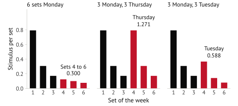

## The gap

Training apps record what you lifted and total it up. That tells you whether you trained, and
you find out whether the program was any good two months later, with no way to trace the outcome
back to one decision.

The research is specific about what drives hypertrophy: how much stimulus a set produces as it
approaches failure, and how fatigue accumulates against it across a week. That research sits in
papers, in no form you can apply to your own program.

AlgoSplit does that. Each program gets a predicted weekly outcome across 29 muscle regions before
you run any of it.

## In use

You can compare two programs and find the muscles receiving more volume than they can convert
into growth. You can also move a session to another day and see the effect on the rest of the
week. Take six rear-delt sets a week on the reverse pec deck. At the app defaults, AlgoSplit
scores three schedules for them. Net is stimulus minus atrophy:

| Schedule             | Stimulus | Atrophy |    Net |
| -------------------- | -------: | ------: | -----: |
| 6 sets Monday        |    1.572 |   1.610 | −0.038 |
| 3 Monday, 3 Thursday |    2.543 |   0.966 |  1.577 |
| 3 Monday, 3 Tuesday  |    1.859 |   1.288 |  0.571 |

The same six sets score below zero in one session and 1.577 across Monday and Thursday. Move the
second session to Tuesday, the day after the first, and the net drops to 0.571.

Within one session, each set adds less stimulus than the set before it. The drop follows the
Schoenfeld dose-response curve, the app's default dataset. Each bar below is one set of the week:

Sets 4 to 6 add 0.300 at the end of a Monday session and 1.271 as a separate Thursday session.

A session that starts $h$ hours after the muscle's last one, inside its 48-hour stimulus window,
earns the fraction of the window that has passed:

$$
r(h)=\min\!\left(1,\ \frac{h}{48}\right)
$$

Tuesday sits at $h=24$, so $r=0.5$. With a 0.925 factor for a second training day in a row, the
Tuesday sets add $1.271\times0.5\times0.925=0.588$.

Atrophy accrues at a fixed rate for each idle hour between the close of a window and the next
session or the end of the week:

$$
A=\frac{S(3)}{168-48}\,t_{\text{idle}}=\frac{1.61}{120}\,t_{\text{idle}}
$$

$S(3)=1.61$ is the curve's value at the maintenance volume of three sets, spread over the 120
hours of a week outside one window. The timeline marks the windows and the idle hours for each
schedule:

The Tuesday session extends the window to hour 72, so the rear delts sit idle 96 hours against 72
for Monday and Thursday.

For the model to score a program it has not seen, the parser resolves each lift into the muscles
it works and the fatigue it adds, along with its movement pattern and resistance profile.

Across the first hundred user programs, average net weekly stimulus rose 35 percent, most of it
from undertrained muscles people had not noticed.

## Shipped

Google and Apple sign-in, workout logging with previous entries as placeholders so logging stays
quick between sets, history and trend charts, a 3D stimulus body, custom exercises, saved
program comparisons, and microcycle scheduling. Web and iOS ship from one codebase.

The analysis kernel recomputes all 29 regions on each program change, which was slow in Python.
I ported it to Rust, with uncached p95 down from 31.9 ms to 3.85 ms, and kept the Python version
behind a parity check within $1\times10^{-8}$.
