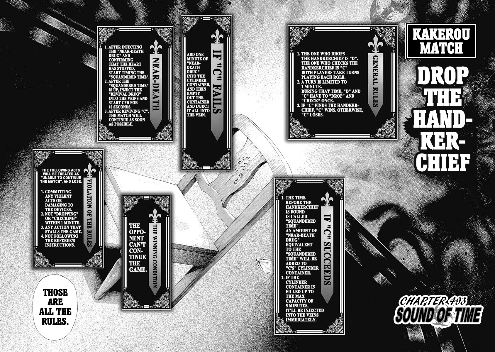

## The rules

That page is enough to follow a match. It is not enough to compute with: some of what a solver
needs shows up only in how the match is played, and in a few places the commentary and the
round-by-round numbers disagree. Before I could solve anything I had to decide what I was
solving.

I wrote every executable rule in the project against a ledger entry that cites its evidence,
with stable IDs so citations survive edits. Where the sources leave a rule open, I made a choice
and recorded why.

One disagreement shows the method. The commentary describes an immediate check as costing zero
seconds, which would make checking free and change the game. The round-by-round numbers show the
player's total going from 0:32 to 0:33 on that turn, so the check costs one second. I followed
the arithmetic, since the rest of the match agrees with it.

## The game

Two players alternate between Dropper and Checker. Each round both commit at the same time to a
second between 1 and 60. If the Checker's second is at or after the Dropper's, the check
succeeds: the Checker absorbs the elapsed interval as poison into a five-minute cylinder, and
the roles swap. If the check fails, the Checker takes everything they have accumulated plus a
sixty-second penalty, which is fatal unless a fixed revival rule saves them. A player who fills
the cylinder past its limit loses on the spot. The last player alive wins.

## The obstacle

Both players commit at the same time, so no single second is safe: any fixed choice gives the
opponent something to exploit. Each round is a small matrix game with a mixed-strategy solution,
and the poison carries into the next round.

Written out directly the game has about 5.27 billion reachable states. For months I tried
approach after approach, and each time I learned that my approximations did not generalize or
that a full solve would take about five years on one core.

## The collapse

The idea came from solving a bucketed version of the game first. Once a player can no longer
survive an injection, the one calculation that reads their time dead returns zero, so I replaced
that coordinate with a single placeholder, one per player. I spent some late nights on math I
had not seen before to prove the quotient preserves the expected game value.

That takes 5.27 billion states to 289,374,121 classes. A potential function sorts the classes
into 1,201 layers where every live move goes up a layer, so one backward pass computes the whole
table with no search.

## Checking the answer

I store a value only with a certificate that it sits within one part in a million of
equilibrium against the full 60 by 60 round. If the certificate fails, the solver tries a more
general method until one verifies.

The round matrix has 61 distinct entries, because a successful check depends on the two seconds
through their difference alone. That structure gives a 59-step recurrence that produces both
players' equilibrium strategies at once, so a certificate costs a few thousand multiply-adds,
and the linear-program fallback stays in the ladder unused.

I wrote the first sweep twice, as a parallel Rust kernel and a Python reference, and the two
agreed byte for byte. The current solver is one Python file with a different algorithm, and it
reproduces the reference values to within 2×10⁻¹¹ at five states and 1.2×10⁻⁹ at the sixth. A
scalar re-solve of 1,200 evenly spaced classes differed from the stored values by at most
9×10⁻¹⁶. Two algorithms landing on the same numbers is the main reason I trust the result.

## Result

Under optimal play the first Dropper wins with probability 0.5449, about four and a half points
for going first. That is less than the estimates I had seen, and I can check it.

The full table of 289,374,121 classes builds in 50 seconds on a laptop from one Python file of
481 lines, against the five years I projected for the search-based design.

The paper and the engine sit in the repository, alongside an OCaml solver that re-derives the
rules as a cross-check and an arena where you can play the solved table.

If I did it again I would start with the simplest version of the game. I jumped in wanting to
replicate AlphaZero, and the useful idea came from the small solve.
