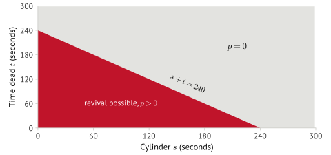
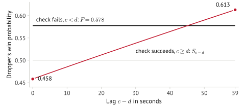

## The rules

That page is enough to follow a match. It is not enough to compute with: some of what a solver
needs shows up only in how the match is played, and in a few places the commentary and the
round-by-round numbers disagree. Before I could solve anything I had to decide what I was
solving.

I wrote every executable rule in the project against a ledger entry that cites its evidence,
with stable IDs so citations survive edits. Where the sources leave a rule open, I made a choice
and recorded why.

One disagreement shows the method. The commentary describes an immediate check as costing zero
seconds, which would make checking free and change the game. The round-by-round numbers show the
player's total going from 0:32 to 0:33 on that turn, so the check costs one second. I followed
the arithmetic, since the rest of the match agrees with it.

## The game

Two players alternate between Dropper and Checker. Each player carries $s,$ the seconds of poison
in their five-minute cylinder, and $t,$ their total time dead. Each round both players pick a
second from 1 to 60 at the same time: the Dropper picks $d$ and the Checker picks $c$. The check
succeeds when $c\ge d$ and fails when $c<d$, and the Checker's $(s,t)$ moves:

$$
(s_c,\,t_c)\ \to\ \begin{cases}
(s_c+c-d+1,\ t_c), & c\ge d \\[2pt]
(0,\ t_c+s_c+60), & c<d,\ \text{prob. } p(s_c,t_c) \\[2pt]
\text{dead}, & c<d,\ \text{prob. } 1-p(s_c,t_c)
\end{cases}
$$

The $+1$ is the 0:32 → 0:33 ruling. A Checker whose cylinder reaches 300 loses, and the roles swap
after every round both players survive. After a failed check, the Checker revives with probability:

$$
p(s,t)=\begin{cases}
0.95\,(1-s/240)\,0.75^{t/60}, & s\le 239,\ s+t\le 240 \\[2pt]
0, & \text{otherwise}
\end{cases}
$$

I mark where one player can still come back, over their cylinder $s$ and time dead $t$:

More poison and more time dead both lower the odds, and above the line $s+t=240$ the odds are
zero. The manga gives no revival rate, so I chose this formula, and the 0.5449 win probability
depends on that choice.

## The obstacle

Both players commit at the same time, so no single second is safe: any fixed choice gives the
opponent something to exploit. Each round is a small matrix game with a mixed-strategy solution,
and the poison carries into the next round.

In the opening round, both players spread their weight over all 60 seconds:

The Dropper puts 27.3 percent on second 1, and the Checker mirrors that on second 60.

Written out directly the game has about 5.27 billion reachable states. For months I tried
approach after approach, and each time I learned that my approximations did not generalize or
that a full solve would take about five years on one core.

## The collapse

The idea came from solving a bucketed version of the game first. Once $p(s,t)=0$, the player dies
on the next failed check, and $t$ has no further use. I keep the cylinder, replace the time dead
with a marker $\bot$, and call each result a class:

$$
\varphi(s,t)=\begin{cases}
(s,\,t), & p(s,t)>0 \\[2pt]
(s,\,\bot), & p(s,t)=0
\end{cases}
$$

I spent some late nights on math I had not seen before to prove that this quotient, $\varphi$,
keeps the game value. The proof is three steps:

$$
\begin{aligned}
& p(s,t)=p(s,t')=0 \\
\implies\ & p(s+\ell,\,t)=p(s+\ell,\,t')=0 \ \text{ for } \ell\ge 1 \quad \text{(a success raises } s) \\
\implies\ & t \text{ and } t' \text{ give the same loss chance and the same next class} \\
\implies\ & V(s,t,\cdot)=V(s,t',\cdot) \quad \text{(backward induction)}
\end{aligned}
$$

Per player, $s$ takes 300 values and $t$ takes 242: 0 before the first revival, then 60 to 300.
$\varphi$ maps those 72,600 pairs to 17,011 classes:

$$
\begin{gathered}
\underbrace{300\times 242}_{72{,}600}\ \to\ \underbrace{16{,}711}_{p>0}+\underbrace{300}_{(s,\,\bot)}=17{,}011 \\[4pt]
17{,}011^2=289{,}374{,}121
\end{gathered}
$$

A potential function sorts the classes into 1,201 layers where every live move goes up a layer, so
one backward pass computes the whole table with no search.

## Checking the answer

I store a value only with a certificate that it sits within one part in a million of
equilibrium against the full 60 by 60 round. If the certificate fails, the solver tries a more
general method until one verifies.

The round matrix has 61 distinct entries, because a successful check depends on the two seconds
through their difference alone. The opening round's whole 60 by 60 matrix fits on one plot:

Every cell on the diagonal $c-d=\ell$ holds $S_\ell$, and every cell below the main diagonal holds
$F$. That structure gives a 59-step recurrence that produces both
players' equilibrium strategies at once, so a certificate costs a few thousand multiply-adds,
and the linear-program fallback stays in the ladder unused.

I wrote the first sweep twice, as a parallel Rust kernel and a Python reference, and the two
agreed byte for byte. The current solver is one Python file with a different algorithm, and it
reproduces the reference values to within $2\times10^{-11}$ at five states and $1.2\times10^{-9}$ at the sixth. A
scalar re-solve of 1,200 evenly spaced classes differed from the stored values by at most
$9\times10^{-16}$. Two algorithms landing on the same numbers is the main reason I trust the result.

## Result

Under optimal play the first Dropper wins with probability 0.5449, about four and a half points
for going first. That is less than the estimates I had seen, and I can check it.

I fill one player's cylinder while the other stays fresh, with $t=0$ for both players:

Against a fresh Checker, the Dropper stays ahead with up to 16 seconds of poison, so going first
is worth about 16 seconds.

The full table of 289,374,121 classes builds in 50 seconds on a laptop from one Python file of
481 lines, against the five years I projected for the search-based design.

## The leap second

The manga's match starts at 8:12 on January 1, with Hal as the first Dropper and Baku checking. A
leap second falls that morning at 8:59:60 Japan time. Baku plans to hold the handkerchief through
8:59 and drop in the extra second, which the Checker cannot match.

I add the clock to the state: $h$ says whether Hal or Baku drops, $\tau$ counts seconds from 8:00,
and $T(\tau)$ is the length of the current minute:

$$
x=(s_c,\,t_c,\,s_d,\,t_d,\,h,\,\tau),\qquad
T(\tau)=\begin{cases}61, & 3540\le\tau\le3600 \\[2pt] 60, & \text{otherwise}\end{cases}
$$

In that window Baku gets a 61st row, and every cell in it is a failed check with payoff $F$.
If $v_{60}$ is the value of the ordinary round:

$$
v_{61}=\max\{v_{60},\,F\}
$$

A mix of the new row and an ordinary strategy pays a weighted average of $F$ and $v_{60}$, so the
best mix sits at one end.

The clock multiplies the table: 9,453,333,117 reachable classes across 2,243 half-and-clock
groups. After 9:00 the game is the base game again, so its table covers the tail. I re-solved
4,621 sampled stages by linear programming, and the largest difference from the stored values
was $3.07\times10^{-9}$.

The clock changes play before the window arrives. I hold Hal at $(s,t)=(0,180)$ and Baku at
$(60,120)$ and move only the minute in which Hal drops:

With the same loads, Hal's chance moves between 21 and 70 percent. Each player has to plan for
who will hold the handkerchief when the extra second arrives. From the opening:

$$
P(\text{Hal wins})=\begin{cases}0.5449, & \text{no leap second} \\[2pt] 0.5186\pm0.0003, & \text{Baku may drop at second 61}\end{cases}
$$

The extra second is worth 2.63 points to Baku.

Both papers and the engine sit in the repository, alongside an OCaml solver that re-derives the
rules as a cross-check and an arena where you can play the solved table.

If I did it again I would start with the simplest version of the game. I jumped in wanting to
replicate AlphaZero, and the useful idea came from the small solve.
